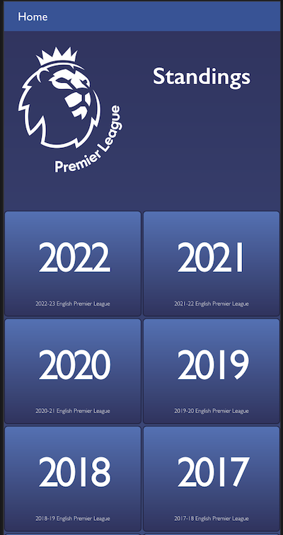
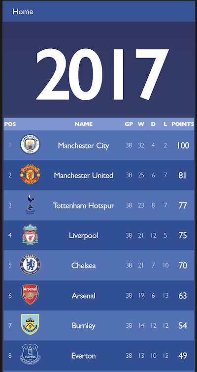

---

  
  

---

# Premier League Standings ⚽️

> Mobile web app to follow scores and standings for the English Premier League, from 2001 season to now.

Original design idea by [Nelson Sakwa on Behance](https://www.behance.net/sakwadesignstudio).

 

## Static Deploy

- [Netlify](https://leagues-standings-raminka.netlify.app/)

## Static Deploy
[Video Presentation](https://youtu.be/Hy242UqNOts)

## Tech ⌘⇧

- **HTML & CSS best practices:** Correct use of tags, elements, properties and syntax.
- **GitHub flow:** Correct use of Branches for deployment and features development.
- **Webpack:** Source development for production bundling.
- **Linters Check:** Local and Pull Request Github workflows to check for stylistic errors, bugs and syntax errors in code.
- **React:** Build on `React.js` framework with jsx.
- **Redux:** Build on `Redux Toolkit` librarie to manage the app state.

## Clone Repository

- Copy this code on your CLI to clone the repository `$ git clone https://github.com/raminka13/premier-standings.git`
- `cd premier-standings`
- run `npm install` to install all the dependencies.
- run `npm start` to open the app in your localServer.

## Author ✍🏼

👤 **Raul A Ospina** 🧑🏻‍💻

- GitHub: [@raminka13](https://github.com/raminka13)
- Twitter: [@raminka13](https://twitter.com/raminka13)
- LinkedIn: [Raul Ospina](http://linkedin.com/in/raul-ospina)

## Project Milestones

- **Milestone 1** Create-React-App, basic components, and Redux store . ✅
- **Milestone 2** Use Redux in React components. ✅
- **Milestone 3** Connect to API. ✅
- **Milestone 4** Styling. ✅
- **Milestone 5** Testing. ✅

## 🤝 Contributing

> Contributions, issues, and feature requests are welcome!
> Feel free to check the [issues page](https://github.com/raminka13/premier-standings/issues).

## Show your support 🦾

- Give a ⭐️ if you like this project!

## License 📝

- This project is [MIT](LICENSE) licensed.

---

   
